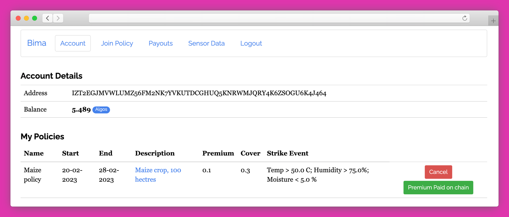

# Bima Insurance Platform

Blockchain based weather index insurance platform.



## Tech Stack 

- `Flask`
- `Algorand`
- `Postgres`


## Setup

To run create a `.env` file in the root directory and populate with the following

``` 
SECRET_FLASK=
TESTNET_ALGOD_API_KEY=
TESTNET_ALGOD_ADDRESS=https://testnet-algorand.api.purestake.io/ps2
TESTNET_ALGOINDEXER_SERVER=https://testnet-algorand.api.purestake.io/idx2
ACCOUNT1_ADDRESS=
ACCOUNT1_MNEMONIC=
ACCOUNT2_ADDRESS=
ACCOUNT2_MNEMONIC=
ADMIN_USERNAME=
ADMIN_PASSWORD=
```

## App Description

The detailed app description is [here](/docs/README.md)

