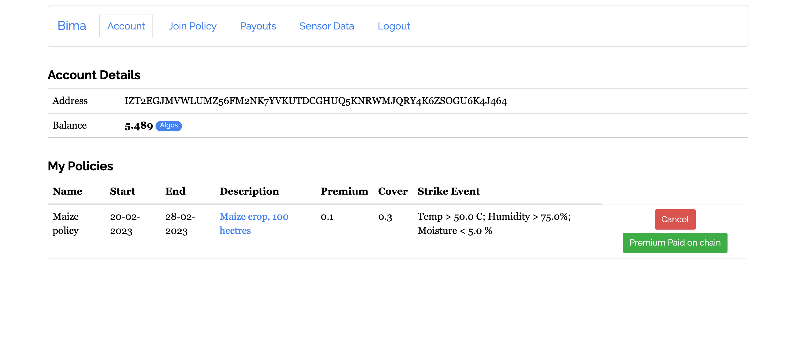

# Login Page

Users login with their 25 word passphrase. If they do not have an account they can hit the `Create Account` button and an account will be created for them. Upon creation the user will receive the pass phrase to their account.

# Account Page

Upon successful login the account page shows the user their account details 

- the account address 
- the account's Algo balance

# Policy Page

On the Policy page the user can join a policy and the transaction will be stored on the blockchain

# Premium page 

On the premium page the user is able to pay their premium 

# Payouts

Still being implemented

