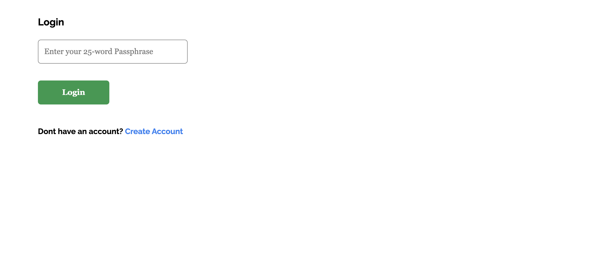
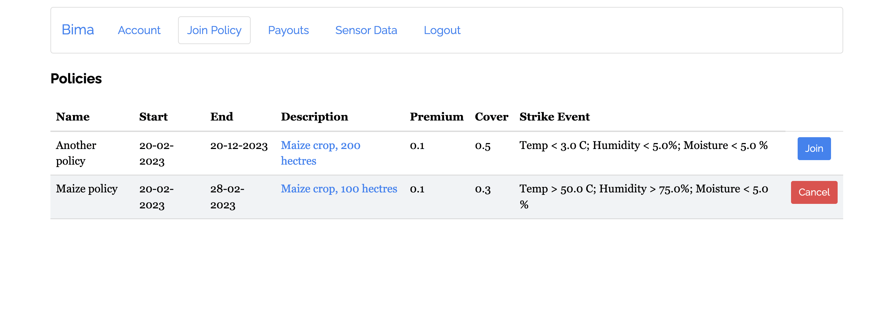
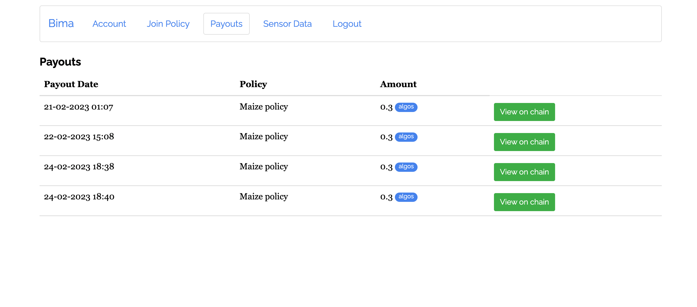

# Login Page

Users login with their 25 word passphrase. If they do not have an account they can hit the `Create Account` button and an account will be created for them. Upon creation the user will receive the pass phrase to their account.

# Account Page

Upon successful login the account page shows the user their account details 

- the account address 
- the account's Algo balance

- the user also sees all the policies they have joined
- they are able to pay their premiums for the current month and the transaction will be stored on chain 

 

# Policy Page

On the Policy page the user can join a policy and the transaction will be stored on the blockchain

# Payouts

Payouts are auto processed when a strike event attached to the user's policy is triggered

# Sensor Data

On the sensor data page a user will see the data collected by the sensors on their farm 

- as a graph with the most recent data displayed first
- the user is able to view the data stored on the blockchain for verifiability of the data

